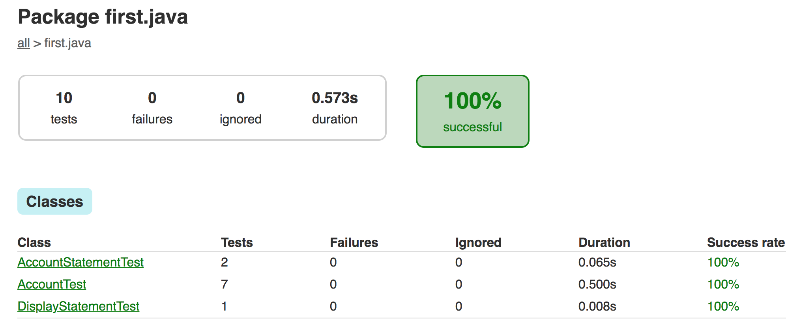

# Bank Tech Test
(My first java code :) )

## Requirements

* You should be able to interact with your code via a REPL.  (You don't need to implement a command line interface that takes input from STDIN.)
* Deposits, withdrawal.
* Account statement (date, amount, balance).
* Data can be kept in memory (it doesn't need to be stored to a database or anything).

## Acceptance criteria

**Given** a client makes a deposit of 1000 on 10-01-2012  
**And** a deposit of 2000 on 13-01-2012  
**And** a withdrawal of 500 on 14-01-2012  
**When** she prints her bank statement  
**Then** she would see

```
date || credit || debit || balance
14/01/2012 || || 500.00 || 2500.00
13/01/2012 || 2000.00 || || 3000.00
10/01/2012 || 1000.00 || || 1000.00
```

## Installation

```
git clone git@github.com:LondonJim/bank-tech-test-java.git
```

## Instructions
#### Build .jar file

```
gradle build
```

#### Use within REPL JShell
```
jshell --class-path ./build/libs/first-java.jar
```

#### Import and instantiate
```
jshell> import first.java.Account;
jshell> Account account = new Account();
```

#### Add funds
```
account.deposit(100.00);
```

#### Withdraw funds
```
account.withdraw(45.75);
```

#### Balance
```
account.currentBalance();
```
return `55.25`

#### Statement
```
account.displayStatement();
```
example return:
```
date || credit || debit || balance
09/05/2019 || 100.0 || || 100.0
08/05/2019 || || 71.65 || 171.65
07/05/2019 || || 100.55 || 171.05
05/05/2019 || 20.20 || || 191.25
```

## Testing
Using JUnit 4.12

```
gradle test
```

View test reports in the browser
```
./build/reports/tests/test/index.html
```

### User Stories

```
As a customer,
so I know how much money I have,
I want to be able to see my balance

As a customer,
so I can increase my balance,
I want to be able to make deposits

As a customer,
so I can spend my money,
I want to be able to make withdrawals

As a customer,
so I can pay for unexpected bills,
I want an overdraft.

As a customer,
so I don't go over my overdraft,
I want to be denied funds over the overdraft amount

As a customer,
so I can see my transactions,
I want to be able to view an account statement
```

